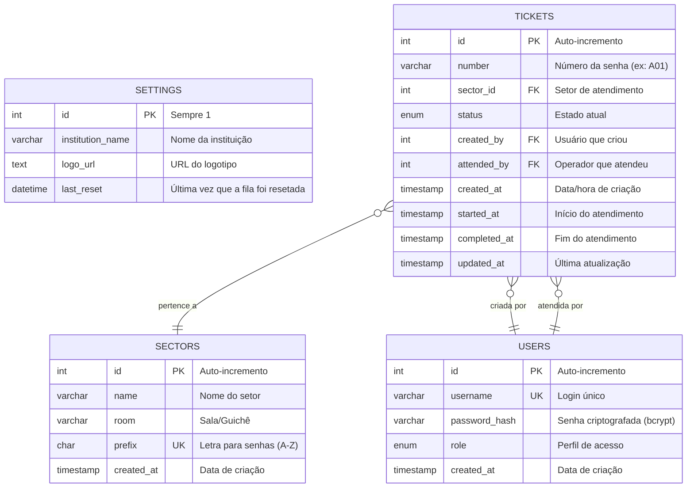
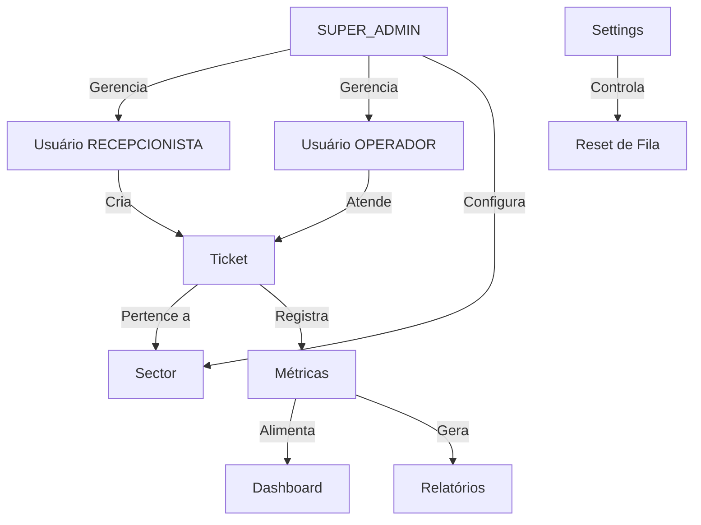

# Documentação do Banco de Dados - FILA-APP

## 📊 Visão Geral

O banco de dados **fila_app** foi projetado para gerenciar filas de atendimento com rastreamento completo de senhas, usuários, setores e métricas de desempenho.

**Sistema de Gerenciamento**: MySQL 5.7+  
**Charset**: utf8mb4  
**Collation**: utf8mb4_unicode_ci

---

## 🗂️ Estrutura de Tabelas

### Diagrama Entidade-Relacionamento (ER)



---

## 📋 Tabelas Detalhadas

### 1. `settings` - Configurações Globais

Armazena configurações gerais do sistema (singleton - apenas 1 registro).

| Campo | Tipo | Nulo | Padrão | Descrição |
|-------|------|------|--------|-----------|
| `id` | INT | NÃO | 1 | Chave primária (sempre 1) |
| `institution_name` | VARCHAR(255) | SIM | 'FILA-APP' | Nome da instituição exibido no sistema |
| `logo_url` | TEXT | SIM | NULL | URL ou caminho do logotipo |
| `last_reset` | DATETIME | SIM | NULL | Timestamp do último reset de fila |

**Constraints:**
- `PRIMARY KEY (id)`
- `CHECK (id = 1)` - Garante apenas 1 registro

**Uso:**
- Configuração de nome institucional
- Controle de reset de fila (soft reset)
- Personalização visual

---

### 2. `users` - Usuários do Sistema

Gerencia autenticação e autorização de usuários.

| Campo | Tipo | Nulo | Padrão | Descrição |
|-------|------|------|--------|-----------|
| `id` | INT | NÃO | AUTO_INCREMENT | Identificador único |
| `username` | VARCHAR(50) | NÃO | - | Login do usuário (único) |
| `password_hash` | VARCHAR(255) | NÃO | - | Senha criptografada (bcrypt) |
| `role` | ENUM | NÃO | - | Perfil de acesso |
| `created_at` | TIMESTAMP | NÃO | CURRENT_TIMESTAMP | Data de criação |

**ENUM `role` - Valores Possíveis:**
- `SUPER_ADMIN` - Acesso total ao sistema
- `GERENTE` - Gestão e relatórios
- `OPERADOR` - Atendimento de senhas
- `PORTEIRO` - Emissão de senhas (futuro)
- `RECEPCIONISTA` - Emissão de senhas

**Constraints:**
- `PRIMARY KEY (id)`
- `UNIQUE KEY (username)`

**Índices:**
- `username` (UNIQUE) - Busca rápida por login

**Segurança:**
- Senhas armazenadas com bcrypt (custo 10)
- Nunca expor `password_hash` em APIs

---

### 3. `sectors` - Setores de Atendimento

Define os setores/departamentos que emitem senhas.

| Campo | Tipo | Nulo | Padrão | Descrição |
|-------|------|------|--------|-----------|
| `id` | INT | NÃO | AUTO_INCREMENT | Identificador único |
| `name` | VARCHAR(255) | NÃO | - | Nome do setor |
| `room` | VARCHAR(50) | SIM | NULL | Sala/Guichê |
| `prefix` | CHAR(1) | NÃO | 'A' | Letra para senhas (A-Z) |
| `created_at` | TIMESTAMP | NÃO | CURRENT_TIMESTAMP | Data de criação |

**Constraints:**
- `PRIMARY KEY (id)`
- `UNIQUE KEY (name, room)` - Evita duplicatas

**Exemplos de Registros:**
```sql
('FARMACIA SAE', 'SAE', 'F')      -- Senhas: F01, F02...
('CONSULTORIO MEDICO 01', '01', 'M') -- Senhas: M01, M02...
('ODONTOLOGIA', 'ODONTO', 'O')    -- Senhas: O01, O02...
```

**Regras de Negócio:**
- `prefix` deve ser único por setor ativo
- Usado para gerar números de senha (ex: `A01`)

---

### 4. `tickets` - Senhas de Atendimento

Registro completo de todas as senhas emitidas e seu ciclo de vida.

| Campo | Tipo | Nulo | Padrão | Descrição |
|-------|------|------|--------|-----------|
| `id` | INT | NÃO | AUTO_INCREMENT | Identificador único |
| `number` | VARCHAR(10) | NÃO | - | Número da senha (ex: A01) |
| `sector_id` | INT | SIM | NULL | FK para `sectors.id` |
| `status` | ENUM | NÃO | 'pending' | Estado atual da senha |
| `created_by` | INT | SIM | NULL | FK para `users.id` (quem criou) |
| `attended_by` | INT | SIM | NULL | FK para `users.id` (quem atendeu) |
| `created_at` | TIMESTAMP | NÃO | CURRENT_TIMESTAMP | Data/hora de emissão |
| `started_at` | TIMESTAMP | SIM | NULL | Início do atendimento |
| `completed_at` | TIMESTAMP | SIM | NULL | Fim do atendimento |
| `updated_at` | TIMESTAMP | NÃO | CURRENT_TIMESTAMP | Última atualização |

**ENUM `status` - Ciclo de Vida:**
1. `pending` - Aguardando na fila
2. `calling` - Sendo chamada no painel
3. `in_service` - Em atendimento
4. `completed` - Atendimento concluído
5. `redirected` - Redirecionada para outro setor
6. `canceled` - Cancelada pelo operador
7. `not_shown` - Cliente não compareceu

**Constraints:**
- `PRIMARY KEY (id)`
- `FOREIGN KEY (sector_id) REFERENCES sectors(id) ON DELETE SET NULL`
- `FOREIGN KEY (created_by) REFERENCES users(id)`
- `FOREIGN KEY (attended_by) REFERENCES users(id)`

**Índices Recomendados:**
```sql
CREATE INDEX idx_status ON tickets(status);
CREATE INDEX idx_created_at ON tickets(created_at);
CREATE INDEX idx_sector_status ON tickets(sector_id, status);
```

**Métricas Calculadas:**
- **Tempo de Espera**: `started_at - created_at`
- **Tempo de Atendimento**: `completed_at - started_at`
- **Tempo Total**: `completed_at - created_at`

---

## 🔗 Relacionamentos

### Diagrama de Fluxo de Dados



### Cardinalidade

| Relação | Tipo | Descrição |
|---------|------|-----------|
| `tickets.sector_id → sectors.id` | N:1 | Muitas senhas pertencem a 1 setor |
| `tickets.created_by → users.id` | N:1 | Muitas senhas criadas por 1 usuário |
| `tickets.attended_by → users.id` | N:1 | Muitas senhas atendidas por 1 usuário |

---

## 📊 Consultas Comuns

### 1. Senhas Aguardando por Setor
```sql
SELECT t.number, t.created_at, s.name as sector_name
FROM tickets t
JOIN sectors s ON t.sector_id = s.id
WHERE t.status = 'pending'
  AND t.sector_id = ?
ORDER BY t.created_at ASC;
```

### 2. Tempo Médio de Espera (Hoje)
```sql
SELECT 
    AVG(TIMESTAMPDIFF(MINUTE, created_at, started_at)) as avg_wait_minutes
FROM tickets
WHERE DATE(created_at) = CURDATE()
  AND started_at IS NOT NULL;
```

### 3. Produtividade por Operador
```sql
SELECT 
    u.username,
    COUNT(*) as total_atendimentos,
    AVG(TIMESTAMPDIFF(MINUTE, t.started_at, t.completed_at)) as avg_service_time
FROM tickets t
JOIN users u ON t.attended_by = u.id
WHERE t.status = 'completed'
  AND DATE(t.created_at) = CURDATE()
GROUP BY u.id
ORDER BY total_atendimentos DESC;
```

### 4. Fluxo Horário (Hoje)
```sql
SELECT 
    HOUR(created_at) as hour,
    COUNT(*) as count
FROM tickets
WHERE DATE(created_at) = CURDATE()
GROUP BY HOUR(created_at)
ORDER BY hour;
```

### 5. Próximo Número de Senha (Após Reset)
```sql
SELECT number 
FROM tickets 
WHERE sector_id = ? 
  AND created_at > (SELECT last_reset FROM settings WHERE id = 1)
ORDER BY id DESC 
LIMIT 1;
```

---

## 🔐 Segurança e Integridade

### Regras de Integridade Referencial

1. **ON DELETE SET NULL** em `tickets.sector_id`:
   - Se um setor for deletado, senhas antigas mantêm histórico mas sem setor
   - Evita perda de dados históricos

2. **Foreign Keys em `created_by` e `attended_by`**:
   - Garante rastreabilidade
   - Impede deleção de usuários com histórico

### Validações Recomendadas (Aplicação)

```javascript
// Exemplo de validação antes de INSERT
if (!['pending', 'calling', 'in_service', 'completed', 
      'redirected', 'canceled', 'not_shown'].includes(status)) {
    throw new Error('Status inválido');
}

// Validação de transição de status
const validTransitions = {
    'pending': ['calling', 'canceled'],
    'calling': ['in_service', 'not_shown'],
    'in_service': ['completed', 'redirected', 'canceled']
};
```

---

## 📈 Otimização e Performance

### Índices Essenciais
```sql
-- Busca por status (painel, operador)
CREATE INDEX idx_status ON tickets(status);

-- Filtros de data (relatórios)
CREATE INDEX idx_created_at ON tickets(created_at);

-- Consultas combinadas
CREATE INDEX idx_sector_status ON tickets(sector_id, status);
CREATE INDEX idx_sector_date ON tickets(sector_id, created_at);

-- Busca por operador
CREATE INDEX idx_attended_by ON tickets(attended_by);
```

### Manutenção

**Limpeza de Dados Antigos** (Opcional):
```sql
-- Arquivar senhas com mais de 1 ano
DELETE FROM tickets 
WHERE created_at < DATE_SUB(NOW(), INTERVAL 1 YEAR)
  AND status IN ('completed', 'canceled', 'not_shown');
```

**Análise de Tabela**:
```sql
ANALYZE TABLE tickets;
OPTIMIZE TABLE tickets;
```

---

## 🔄 Migrações e Versionamento

### Histórico de Alterações

| Versão | Data | Alteração |
|--------|------|-----------|
| 1.0 | 2026-01 | Schema inicial |
| 1.1 | 2026-01 | Adicionado `prefix` em `sectors` |
| 1.2 | 2026-01 | Adicionado `created_by`, `attended_by` |
| 1.3 | 2026-01 | Adicionado `started_at`, `completed_at` |
| 1.4 | 2026-02 | Adicionado `last_reset` em `settings` |

### Script de Migração Seguro

O arquivo `database.sql` usa verificações condicionais para evitar erros:

```sql
-- Exemplo: Adicionar coluna apenas se não existir
SET @col_exists = (
    SELECT COUNT(*) 
    FROM INFORMATION_SCHEMA.COLUMNS 
    WHERE TABLE_NAME = 'tickets' 
      AND COLUMN_NAME = 'started_at'
);

SET @sql = IF(@col_exists > 0, 
    'SELECT 1', 
    'ALTER TABLE tickets ADD COLUMN started_at TIMESTAMP NULL'
);

PREPARE stmt FROM @sql;
EXECUTE stmt;
DEALLOCATE PREPARE stmt;
```

---

## 📦 Backup e Restauração

### Backup Completo
```bash
mysqldump -u root -p \
  --single-transaction \
  --routines \
  --triggers \
  fila_app > backup_fila_app_$(date +%Y%m%d_%H%M%S).sql
```

### Backup Apenas Dados
```bash
mysqldump -u root -p \
  --no-create-info \
  --complete-insert \
  fila_app > data_only_$(date +%Y%m%d).sql
```

### Restauração
```bash
mysql -u root -p fila_app < backup_fila_app_20260202.sql
```

---

## 🎯 Casos de Uso - Queries Avançadas

### Dashboard "Sala de Guerra"

**KPIs em Tempo Real:**
```sql
-- Senhas na fila AGORA
SELECT COUNT(*) FROM tickets WHERE status = 'pending';

-- Total de senhas HOJE
SELECT COUNT(*) FROM tickets WHERE DATE(created_at) = CURDATE();

-- Tempo médio de espera HOJE
SELECT AVG(TIMESTAMPDIFF(MINUTE, created_at, started_at)) 
FROM tickets 
WHERE DATE(created_at) = CURDATE() AND started_at IS NOT NULL;
```

**Distribuição de Paciência:**
```sql
SELECT 
    CASE 
        WHEN TIMESTAMPDIFF(MINUTE, created_at, started_at) < 15 THEN 'Rápido'
        WHEN TIMESTAMPDIFF(MINUTE, created_at, started_at) BETWEEN 15 AND 45 THEN 'Médio'
        ELSE 'Crítico'
    END as patience_level,
    COUNT(*) as count
FROM tickets
WHERE DATE(created_at) = CURDATE() 
  AND started_at IS NOT NULL
GROUP BY patience_level;
```

---

**Versão**: 1.0  
**Última Atualização**: Fevereiro 2026  
**Licença**: GNU GPL v3  
**Banco de Dados**: MySQL 5.7+
